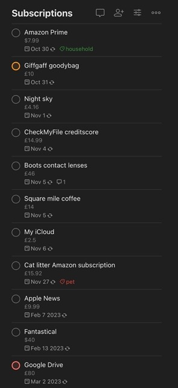

# Todoist Subscriptions Reporter

How much I'm spending on subscriptions, in average?

If you are a weird Todoist person like me - tracking you various subscription as recurring tasks
you might eventually get lost in manually calculating average monthly costs.



This quickly becomes a problem, especially if your subscriptions has a) **different cadence**
(annual, bi-monthly, monthly, quarterly, every week, e.t.c) and b) **different currencies**

This project retrieves your tasks from the list and tries to calculate the average cost per month.

## Notes taking rules

Quickly add a new subscription in todoist quick-add prompt:

`Amazon Prime #Subscriptions every month` tab `£8.99`

That will create a task, that we can work with:

- Task **name** is the subscription name, i.e.: `Amazon Prime`
- Task **description** is a price, with some currency marker: `£8.99`
- Task **cadence** is a string that this script will have to be able to map

## Installation

```
gh repo clone xenjke/todoist-subscriptions-reporter
cd todoist-subscriptions-reporter
npm i
```

## Usage

```
API_TOKEN=<your_todoist_api_token> PROJECT_NAME=<partial_project_name> npx ts-node ./index.ts
```
